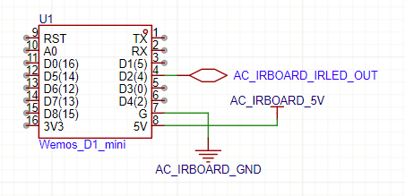
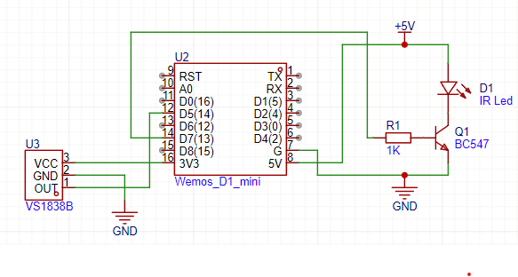
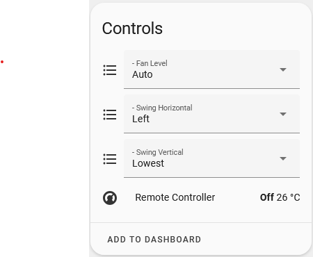
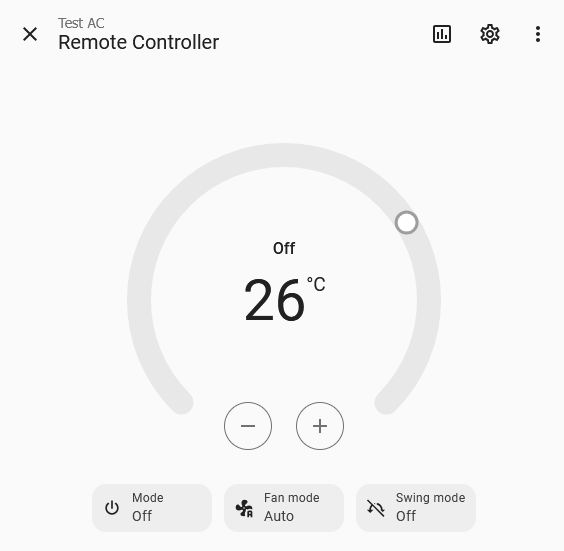
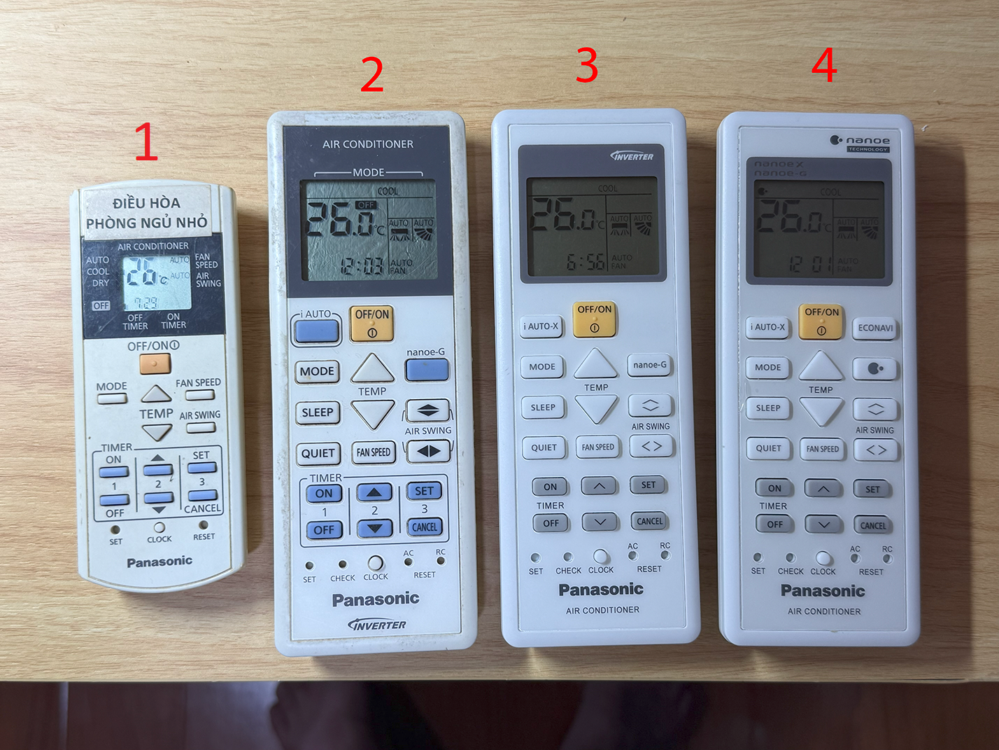

# Panasonic AC IR Remote Controller for ESPHome

This is a custom ESPHome external component for controlling Panasonic air conditioners via infrared.

It **inherits from ESPHome's `ClimateIR`** and adds support for:
- **IR Receiver** to detect and decode Panasonic AC remote commands (216 bit frame)
- **Temperature step** (0.5 or 1.0 degree)
- **Fan Level Control** (1–5, plus quiet)
    - Default 3 levels without quiet, can configure 5 levels and quiet separately
- **Swing Control**:
  - **Vertical Swing** (Highest, High, Middle, Low, Lowest, Auto)
  - **Horizontal Swing** (Left Max, Left, Middle, Right, Right Max, Auto)
    - Default off, can configure on.

---

## 🛠 Features

- ✅ Compatible with Panasonic IR protocol (216 bit - 27 bytes frame)
- ✅ Based on ESPHome `ClimateIR` class for climate control
- ✅ IR receiver support to sync state from physical remote
- ✅ `select` components for:
  - Fan level 
  - Swing vertical
  - Swing horizontal
- ✅ Auto state updates when IR signal is received

---

## 📦 Requirements

- ESP32 or ESP8266 board
You have 2 options to install ESPHome module to you AC.

- **1. Invasive way:** You must have physical access to Panasonic AC IR board
    - Wiring Panasonic AC IR board with ESP board
        - ESP GND <-> Pana AC IR board's GND
        - ESP 5V <-> Pana AC IR board's VCC (make sure your AC IR board supplies 5V)
        - ESP GPIO <--> Pana AC IR board's IR Led output

    

- **2. Non-invasive way:** If you don't want to mod your AC IR board (invasive way), you have choice to do as below
    - Make your own IR led receiver and IR led transmitter circuit (via transistor). Refer below schematic.
    - Connect IR led receiver circuit and IR led transmitter circuit to ESP GPIOs.

    

    - Configure ESPHome yaml `remote_receiver` and `remote_transmitter` with respective GPIOs.
    - One important thing is, you have to install your ESP8266 module near the the AC indoor unit:
        - It has to be able to receive signal from physical remote same as AC unit.
        - Its IR transmitter led has to point to the AC IR module, so the command sends from it can come to the AC.
    - This way, you have to additionally configure the `panaac` climate with `ir_control: True`
- **NOTE:**
    - Method 1 brings much more stability and performance, as it captures the IR signal and feeds the control command directly to AC IR board.
    - **Recommendation:** during testing phase, you can use method 2, but for long-term usage it's highly recommended to install it as method 1.


---

## 📂 Installation

1. Copy `esphome/components/panaac` folder to your HASS ESPHome `components` folder.
2. Add climate component to your ESPHome YAML configuration (refer example `ac-test-1.yaml` and `ac-test-2.yaml`)

    - If you're connecting ESP GPIO directly to IR led signal pin on AC IR board (invasive way), you need to set the `remote_receiver` and `remote_transmitter` use the same GPIO pin.

        ```yaml
        remote_receiver:
            pin:
                number: GPIO4
                inverted: True
                mode: OUTPUT_OPEN_DRAIN
                allow_other_uses: True # needed for same pin
            tolerance: 55%
            id: ir_receiver
            idle: 5ms # required

        remote_transmitter:
            carrier_duty_percent: 50%
            pin:
                number: GPIO4
                inverted: True
                mode: OUTPUT_OPEN_DRAIN
                allow_other_uses: True # needed for same pin

        climate:
            - platform: panaac
                name: "Remote Controller"
                receiver_id: ir_receiver
                supports_fan_only: true
                supports_heat: true
                supports_quiet: true
                fan_5level: true
                swing_horizontal: false
                temp_step: 0.5
                ir_control: false
        ```

    - If you're installing the ESPHome device as a separated device and communicate with AC with real IR leds (non-invasive way), use different GPIO pins for `remote_receiver` and `remote_transmitter`. **Additionaly parameter `ir_control` needs to be True**.

        ```yaml
        remote_receiver:
            pin:
                number: GPIO14
                inverted: True
            tolerance: 55%
            id: ir_receiver
            idle: 5ms # required

        remote_transmitter:
            carrier_duty_percent: 50%
            pin:
                number: GPIO13

        climate:
            - platform: panaac
                name: "Remote Controller"
                receiver_id: ir_receiver
                supports_fan_only: true
                supports_heat: true
                supports_quiet: True
                fan_5level: True
                swing_horizontal: True
                temp_step: 0.5
                ir_control: True
        ```

    - **NOTE:**
        - Panasonic AC IR protocol includes 2 IR frames
            - First fixed 8-byte frame contains kind of magic number for Pana AC
            - Second 19-byte frame contains the AC state.
            - There is a frame gap 10000us (10ms).
        - Default ESPHome `remote_receiver` idle time is also 10ms.
        - Because of same duration between frame gap and `remote_receiver` idle time, it is quite unstable in recognizing IR frames
            - Sometimes it detects as a full 27-byte frame.
            - Sometimes it detects as 2 consecutive frames.
        - The trick here is set `idle: 5ms` to the `remote_receiver`, so it always splits the IR signal into 2 different frames. IR signal receiving becomes stable.

---

## 🖼️ Screenshots

Here is how the component appears in Home Assistant:




## 📝 Testing

The panaac component has been tested with ESP8266 and ESP32 using below Panasonic AC remotes with QKH, TKH, SKH units.



Any user is welcome to test on your own, and if there's any problem please create an issue and we'll look into it.